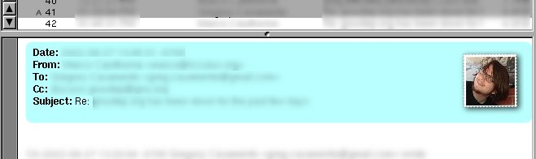

# GNUMail Face Bundle

This was originally part of GNUMail, however it had been removed for license reasons.
Going to keep it alive so it doesn't get lost. I've also modified it so it'll handle mails better that contain both keys to prioritize one over the other.

## Using it in GNUMail
In GNUMail, under Preferences > Sending you'll be able to enter your X-Image-URL and X-Face values.

### X-Face
If you want to know how generate an X-Face, please look here: http://www.dairiki.org/xface/
They are 48x48 1-bit images.

### X-Image-URL
X-Image-URL on the other hand is just a link to a remote image. Like a PNG or a JPEG.
I recommend one with a resolution of 60x60 px.

## Wishlist
- Look up contact photos from the AddressBook framework first, before attempting to parse either X-Face or X-Image-URL.
- Support 'Face', which is simply a base64 encoded PNG (http://quimby.gnus.org/circus/face/)